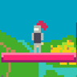
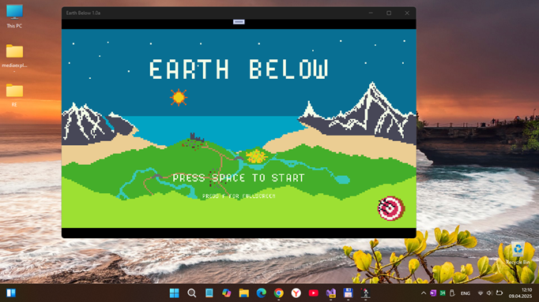
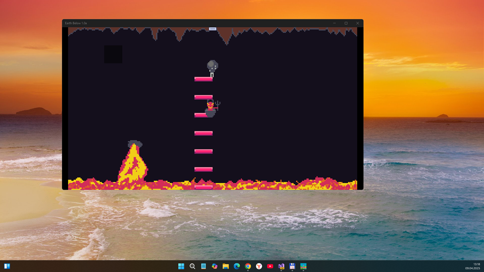
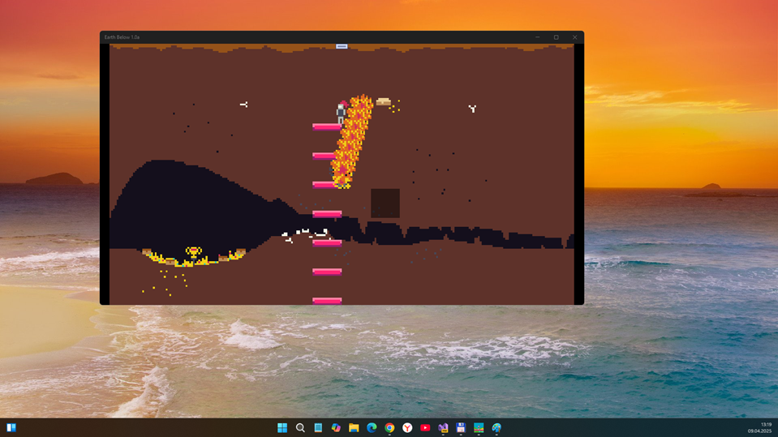
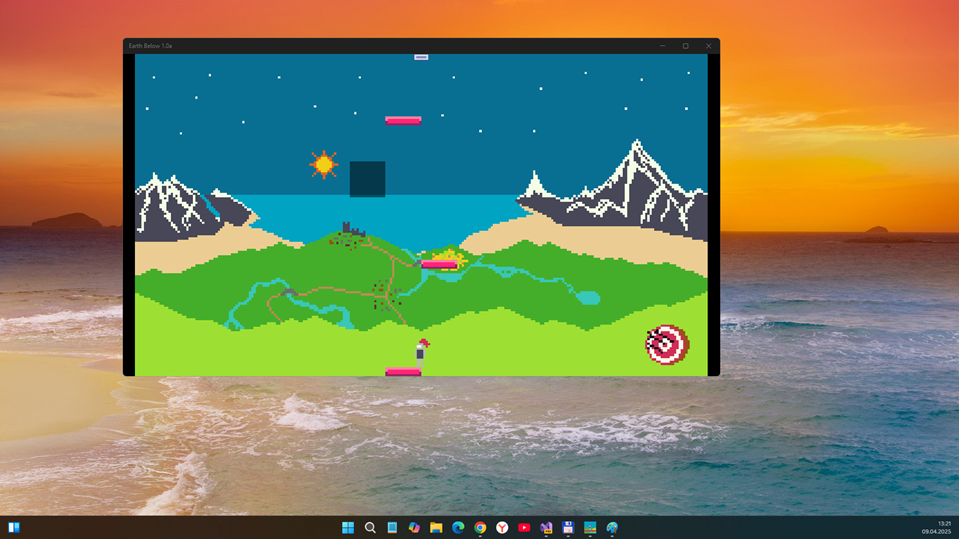

# Earth Below 1.0-alpha - uwp branch 

"UWP-Remake" of ITCH.io Earth Below, fun game project. :)

## About
"It's LudumDare57 project. Game scanario: the goal is to go up!"

## Screenshots

## Controls & scenario
- Use WASD to move. 
- LEFT CLICK to add/remove blocks anywhere on screen.
- You can use SHIFT to no to fall from the edge. The goal is to go up.

## My 2 cents
-  NET -> UWP
- Min. Win. SDK = 10240 
- God mode added :)

## ToDo
- Add touchpanel support (fow old sweet win-phones/ win-tanblets/UMPCs...)

## .
As is. No support. DIY. Learn purposes only.

## Reference(s)
- https://github.com/whateverdat/LudumDare57_Earth_Below
- https://whateverdat.itch.io/earth-below Original project (Windows, Web, and Linux ...)
- https://github.com/whateverdat WhatEverDat, Cool Game Developer / C# / MonoGame Developer :)

## ..
[m][e] April 2025
